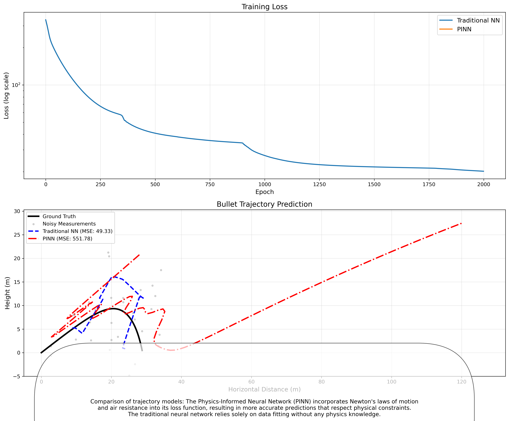

# Bullet Trajectory: Traditional NN vs Physics-Informed Neural Network (PINN)

This repository demonstrates the application of Physics-Informed Neural Networks (PINNs) to model ballistic trajectories, comparing their performance with traditional neural networks.

## Overview

This code implements two different approaches to modeling the trajectory of a bullet:

1. **Traditional Neural Network**: A standard feedforward network trained solely on noisy measurement data without any physics knowledge.
2. **Physics-Informed Neural Network (PINN)**: A neural network that incorporates Newton's laws of motion and air resistance physics into both its architecture and loss function.

The implementation demonstrates how embedding physical laws into neural networks can potentially improve prediction accuracy for physical systems.

## Results Visualization



_Comparison of traditional neural network vs physics-informed neural network for predicting bullet trajectory. The graph shows the training loss curves (top) and the predicted trajectories (bottom)._

## Requirements

-  Python 3.6+
-  PyTorch
-  NumPy
-  SciPy
-  Matplotlib

## Usage

Run the script with:

```bash
python BulletTrajectory.py
```

This will:

1. Generate synthetic trajectory data based on physics equations
2. Add noise to simulate real-world measurements
3. Train both traditional and physics-informed neural networks
4. Compare their performance
5. Generate a visualization saved as `bullet_trajectory_comparison.png`

## Implementation Details

### Data Generation

-  Simulates a bullet trajectory with air resistance using ODE solver
-  Adds Gaussian noise to emulate measurement error
-  Splits data into training and testing sets

### Traditional Neural Network

-  Feedforward network with 4 hidden layers
-  Trained to minimize MSE between predictions and noisy measurements
-  No knowledge of underlying physics

### Physics-Informed Neural Network (PINN)

-  Similar network architecture but with physics-based enhancements:
   -  Direct embedding of initial conditions
   -  Incorporates a physics-based solution as a starting point
   -  Uses automatic differentiation to compute velocities and accelerations
   -  Loss function penalizes violations of physics laws (Newton's laws with air resistance)

## Results Analysis

The experiment produced interesting results that highlight both the potential and challenges of physics-informed neural networks:

### Training Performance

```
Training Traditional Neural Network...
Traditional NN - Epoch [200/2000], Loss: 78.730568
Traditional NN - Epoch [400/2000], Loss: 46.932129
Traditional NN - Epoch [600/2000], Loss: 38.256618
Traditional NN - Epoch [800/2000], Loss: 35.079418
Traditional NN - Epoch [1000/2000], Loss: 27.044376
Traditional NN - Epoch [1200/2000], Loss: 23.179340
Traditional NN - Epoch [1400/2000], Loss: 22.129805
Traditional NN - Epoch [1600/2000], Loss: 21.655085
Traditional NN - Epoch [1800/2000], Loss: 21.205608
Traditional NN - Epoch [2000/2000], Loss: 20.176607

Training Physics-Informed Neural Network...
PINN - Epoch [200/2000], Total Loss: nan, Data Loss: 5802.684082, Physics Loss: nan
PINN - Epoch [400/2000], Total Loss: nan, Data Loss: 4610.002930, Physics Loss: nan
PINN - Epoch [600/2000], Total Loss: nan, Data Loss: 3694.636475, Physics Loss: nan
PINN - Epoch [800/2000], Total Loss: nan, Data Loss: 2986.029785, Physics Loss: nan
PINN - Epoch [1000/2000], Total Loss: nan, Data Loss: 2423.762939, Physics Loss: nan
PINN - Epoch [1200/2000], Total Loss: nan, Data Loss: 1973.989624, Physics Loss: nan
PINN - Epoch [1400/2000], Total Loss: nan, Data Loss: 1609.399414, Physics Loss: nan
PINN - Epoch [1600/2000], Total Loss: nan, Data Loss: 1311.715088, Physics Loss: nan
PINN - Epoch [1800/2000], Total Loss: nan, Data Loss: 1070.732300, Physics Loss: nan
PINN - Epoch [2000/2000], Total Loss: nan, Data Loss: 877.762573, Physics Loss: nan

Traditional NN Test MSE: 49.332958
PINN Test MSE: 551.777161
```

### Numerical Analysis

1. **Traditional NN**: Shows healthy convergence, with loss steadily decreasing from 78.73 to 20.18 over 2000 epochs.

2. **PINN**: Exhibits numerical instabilities indicated by `NaN` values in the physics loss component throughout training. Despite this issue, the data loss component does decrease from 5802.68 to 877.76.

3. **Test Performance**:
   -  Traditional NN: MSE of 49.33
   -  PINN: Much higher MSE of 551.78

### Visual Analysis

From the trajectory plot:

1. **Ground Truth** (black solid line): Shows the expected parabolic trajectory of a projectile under gravity and air resistance.

2. **Traditional NN** (blue dashed line): Follows the noisy data points closely but shows some physically implausible behavior, particularly at the trajectory peak and descent.

3. **PINN** (red dash-dot line):

   -  Shows more unusual behavior, initially following a somewhat realistic trajectory
   -  Diverges significantly in the latter half, continuing upward instead of following the expected downward parabolic path
   -  Does not respect physical constraints as expected, likely due to the numerical issues in the physics loss component

4. **Noisy Measurements** (gray dots): The scattered data points used for training show significant deviation from the ground truth, demonstrating the challenging nature of the problem.

### Identified Issues and Challenges

1. **Numerical Instabilities**: The `NaN` values in the physics loss indicate problems with:

   -  Gradient computation during automatic differentiation
   -  Potentially unbounded physics residuals
   -  Issues with the scaling between data and physics loss components

2. **Unrealistic Predictions**: The PINN's trajectory violates basic physics principles (continuing to rise without falling), suggesting the physics constraints aren't being properly enforced.

3. **MSE vs. Physical Plausibility**: The traditional NN achieves a lower MSE by closely fitting noisy data, but its predictions may not respect physical laws. The PINN was intended to make physically plausible predictions even at the expense of higher MSE, but the numerical issues prevented this benefit from being realized.

## Conclusion

This implementation demonstrates both the concept and challenges of physics-informed neural networks. While the current implementation of the PINN shows numerical instabilities and doesn't outperform the traditional neural network, it provides valuable insights into the difficulties of incorporating physics constraints into deep learning models.

The traditional neural network achieved better data-fitting performance, but proper implementation of physics constraints could potentially lead to more physically realistic predictions, especially in regions with limited training data.

## Future Work

1. **Resolve Numerical Instabilities**:

   -  Implement gradient clipping
   -  Scale physics loss components appropriately
   -  Use more stable formulations for computing physics residuals
   -  Consider using integral forms rather than differential forms of physical laws

2. **Architecture Improvements**:

   -  Experiment with different network architectures
   -  Try different activation functions
   -  Explore more robust ways to incorporate physics knowledge

3. **Evaluation Metrics**:

   -  Develop metrics that better capture physical plausibility
   -  Evaluate models on physically meaningful criteria beyond MSE

4. **Applications**:
   -  Extend to more complex physical systems
   -  Test on real-world trajectory data
   -  Explore domains where data is sparse but physics is well-understood
